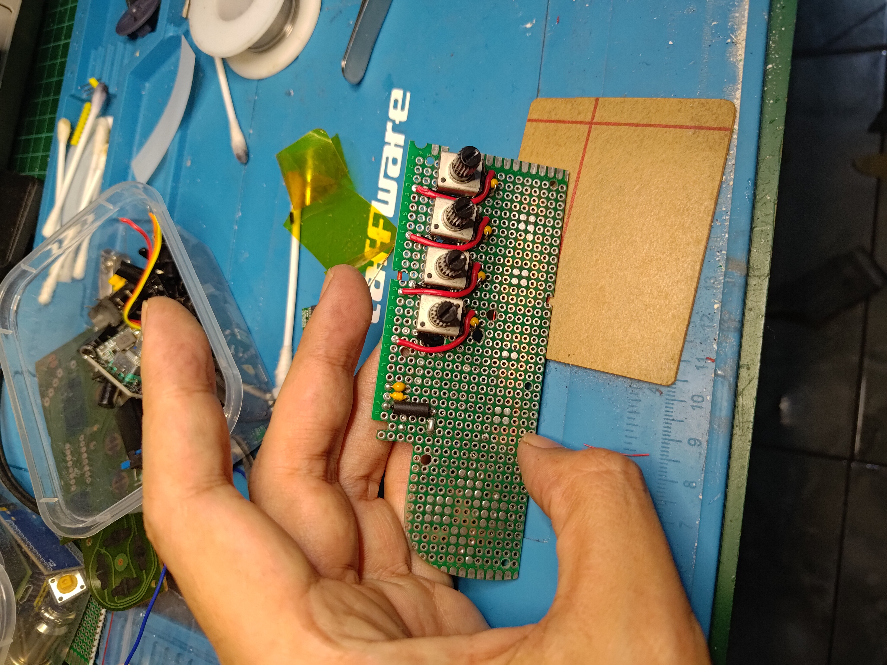

# MonoSync Controller Firmware

**MonoSync** is a unified USB Gamepad + USB MIDI Controller platform built around the RP2040, supporting two hardware tiers: **MonoSync Lite** and **MonoSync XL**. This repository contains the firmware for both models, designed for modularity, stability, and cross-platform compatibility.

---

## Features

### MonoSync Lite
- 8 Gamepad Buttons: UP, DOWN, LEFT, RIGHT, A, B, START, SELECT
- 4 Ultra-stable analog pots (MIDI CC output)
- USB Composite Device: HID Gamepad + MIDI
- Clean, compact hardware (RP2040)
- GPIO0 & GPIO1 reserved for expansion

### MonoSync XL (Planned)
- All Lite features
- Additional buttons, rotary encoders, MIDI pads
- Internal clock, sequencer, arpeggiator, MIDI clock OUT
- 7-segment/OLED display for tempo, CC, mode
- EEPROM/FRAM storage for user settings
- Advanced transport and sync features

---

## Firmware Architecture

- **input.c** — GPIO, ADC acquisition, filtering
- **engine.c** — State change detection, HID & MIDI dispatch
- **usb_gamepad.c** — HID report generation
- **usb_midi.c** — MIDI stream I/O
- **usb_descriptors.c** — USB composite HID+MIDI descriptors
- **tusb_config.h** — TinyUSB configuration

### Key Firmware Features
- 32× oversampling, EMA smoothing, hysteresis for analog inputs
- Change-only sending for HID and MIDI (no spam)
- D-pad mapped to X/Y axes, A/B/SELECT/START to HID buttons
- MIDI CC mapping for each pot (Lite), extended controls for XL

---

## Hardware Overview

- RP2040 module-based
- Low-noise analog section (ferrite bead, RC filtering, decoupling)
- THT tactile switches and pots
- Optional headers for expansion
- USB powered (no battery in Lite)

---

## Supported Platforms

- Android, PC, Mac, Retro handhelds, Raspberry Pi
- Tested on M8 Headless and mobile DAWs

---

## Getting Started

1. **Clone this repository**
2. **Build the firmware** using the provided CMake configuration
3. **Flash to RP2040** using your preferred method (UF2, OpenOCD, etc.)
4. **Connect via USB** — device will enumerate as HID Gamepad + MIDI

---

## Project Roadmap

- [x] MonoSync Lite firmware and PCB v1.0
- [ ] MonoSync XL schematic/layout
- [ ] Encoder support in firmware
- [ ] Clock/arp/sequencer engine
- [ ] FRAM/EEPROM memory map
- [ ] Enclosure and panel design
- [ ] Expanded documentation

---

## Project Preview

[▶️ Demo Video](preview/demo.mp4)

---

## License

Open hardware and firmware. See LICENSE for details.

---

## Contributing

Contributions, issues, and feature requests are welcome! Please see the documentation and roadmap for guidance.

---
